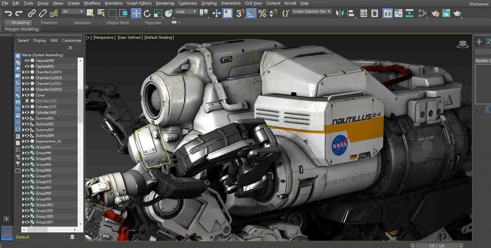

# Démonstration technique : 
## Le CGI (computer-generated imagery)

## Les divers usages du CGI.

- La création de prototype pour l'industrialisation d'un produit.
- La conception de jeu vidéo.
- L'utilisation de la 3d dans le cinéma (computer-generated imagery, CGI)
 
 

## L'histoire du CGI
#### Les premières experimentations avec les animations par ordinateur remonte aux années 40. Ces expérimentations faite par John Whitney, un pionnier du CGI. Whitney plus tard fera affaire avec Saul Bass et intègrera le CGI pour la première fois dans un film.
 
 

## L'évolution du CGI dans les films.
### La première ittération du CGI.
#### (1958) Générique de Vertigo (film d'Alfred Hitchcock) réalisée par Saul Bass.
https://www.youtube.com/watch?v=GQwp6M2q1NE&t=111s&ab_channel=UltimateHistoryofCGI
## Quelques exemples.

### 1.(1972) Le premier modèle 3D fait avec l'assistance d'un ordinateur (Edwin Catmull et Fred Parke.)

### 2.(1993) Jurassic Park
#### Probablement le meilleur CGI pour son temps.

### 3.(1995) Toy Story
#### Le premier film entièrement réalisée en CGI.

### 4.(2009) Avatar
#### Un chef-d'oeuvre du CGI moderne.  

## A quoi sert le CGI dans les films?

- Il sert principalement a éviter de construire des environnements complets pour une scène.
- Aussi a créer des personnages impossibles a créer sans le CGI.

## Logiciels de modélisation 3D
- Autodesk (développé en 1982 par John Walker)
- Blender

 
- Maya

 

